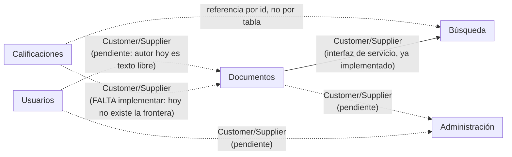

# Mapa de contextos delimitados — Semana 6

## Pregunta guía

**¿Qué palabra de nuestro dominio significa dos cosas según con quién hablemos?**

**Respuesta:** *"calificación"*. En el código actual (`app/documentos/repository.py`)
es un atributo fijo que trae el documento desde que se crea (dato semilla,
columna `calificacion` en la tabla `documentos`). En el lenguaje real del
proyecto — y en el propio `docs/aspectos/aspectos.md`, que habla de
"valoración de documentos por parte de los usuarios" — una calificación es
el resultado de que un estudiante puntúe un documento después de usarlo:
tiene autor, fecha, y se agrega en un promedio. Son dos modelos distintos
usando el mismo nombre, y hoy solo existe el primero.

Ese hallazgo se documenta en detalle en
[`docs/ddd/auditoria-violaciones.md`](auditoria-violaciones.md) (violación V1).

## Contextos identificados

Los cinco módulos definidos en el ADR 0001 ya corresponden, en la práctica,
a cinco contextos delimitados distintos. Lo que esta semana agrega es la
justificación desde el **lenguaje de los interesados**, no desde el diagrama
de entidades:

| Contexto | Lenguaje propio | Quién lo usa así |
|---|---|---|
| **Usuarios** | "cuenta", "perfil", "rol", "credenciales" | Estudiante que se registra o inicia sesión |
| **Documentos** | "documento" = material académico con archivo, metadatos y autor | Quien publica o clasifica material |
| **Búsqueda** | "documento" = resultado de búsqueda: proyección liviana, ordenada por relevancia/calificación | Estudiante que busca y filtra |
| **Calificaciones** | "calificación" = valoración puntual de un estudiante sobre un documento, con autor y fecha | Estudiante que evalúa lo que usó |
| **Administración** | "usuario"/"documento" = objeto de una acción de moderación (reportar, suspender, retirar) | Administrador |

Nótese que **Documentos** y **Búsqueda** ya usan la palabra "documento" con
significados distintos (activo completo vs. proyección de solo lectura), y
eso está bien resuelto: no comparten tabla, y `busqueda.service` consume a
`documentos.service` por interfaz. Es el mismo patrón que debería aplicarse
a "calificación".

## Relaciones entre contextos

| Relación | Tipo | Estado |
|---|---|---|
| Documentos → Búsqueda | Customer/Supplier | ✅ Implementado correctamente (`busqueda.service` llama a `documentos.service`) |
| Calificaciones → Documentos | Customer/Supplier | ⚠️ No implementado; la frontera no existe porque `calificacion` vive dentro de `documentos` |
| Usuarios → Documentos | Customer/Supplier | ⚠️ No implementado; `documentos.autor` es texto libre, no una referencia a `usuarios` |
| Usuarios → Administración | Customer/Supplier | Pendiente (ninguno de los dos módulos tiene lógica todavía) |
| Documentos → Administración | Customer/Supplier | Pendiente, mismo motivo |
| Almacenamiento de archivos / Correo (externos, ver C4 nivel 1) | Candidatos a capa anticorrupción | No implementados aún; cuando se integren, deben aislarse detrás de un adaptador para que su modelo no entre al dominio de `documentos`/`usuarios` |

No se adopta *shared kernel* en ningún punto: la regla de ADR 0001 ("un
módulo no debe acceder directamente a las tablas internas de otro") es,
en el vocabulario de esta semana, exactamente la regla de **un solo
escritor por dato**.

## Trazabilidad

- Regla base: [`docs/adr/0001-estilo-arquitectonico.md`](../adr/0001-estilo-arquitectonico.md)
- Tabla de propiedad de datos: [`docs/ddd/propiedad-datos.md`](propiedad-datos.md)
- Violaciones y plan de corrección: [`docs/ddd/auditoria-violaciones.md`](auditoria-violaciones.md)
- Cambio de frontera propuesto: [`docs/adr/0003-separacion-contexto-calificaciones.md`](../adr/0003-separacion-contexto-calificaciones.md)
